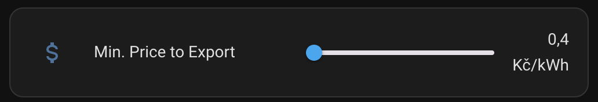

# Home Assistant - Custom Automations & Sensors

This repository contains custom YAML scripts for [Home Assistant](https://www.home-assistant.io/), 
including automations and sensors tailored for smart home setups.

## Overview

- **Automations**: Automate your smart home devices and routines using flexible YAML-based rules.
- **Sensors**: Define custom sensors to monitor and react to various data sources, such as energy 
  prices, device states, and more.

## Index

### Requirements

- [homeassistant_cz_energy_spot_prices](https://github.com/rnovacek/homeassistant_cz_energy_spot_prices) 
  (or other integration that will provide with sensors containing the spot prices for electricity)
- [homeassistant-solax-modbus](https://github.com/wills106/homeassistant-solax-modbus) integration 
  for Solax inverters.

### Automations

Custom automation scripts organized by category.

| Category     | Group          | Automation                                                                                                                                                |
|--------------|----------------|-----------------------------------------------------------------------------------------------------------------------------------------------------------|
| Photovoltaic | Export to grid | [Enable export when spot price is higher or equal than the provided](./automations/pv_export_grid/enable_export_when_spot_price_higher_than_provided.yml) |
| Photovoltaic | Export to grid | [Disable export when spot price is lower than the provided](./automations/pv_export_grid/disable_export_if_spot_price_is_lower_than_provided.yml)         |

### Sensors

Custom sensor definitions organized by category.

| Category     | Group          | Sensor                                                                                                  | Image                                       |
|--------------|----------------|---------------------------------------------------------------------------------------------------------|---------------------------------------------|
| Photovoltaic | Export to grid | [Sensor to configure, via UI, the minimum value to allow exporting excedents from a photovoltaic system.](./sensors/export_spot_price.yml) |  |

## Contributing

Contributions are welcome! Please open issues or pull requests for improvements, bug fixes, or 
new automations/sensors.

## License

This repository is licensed under the [MIT License](LICENSE.md).