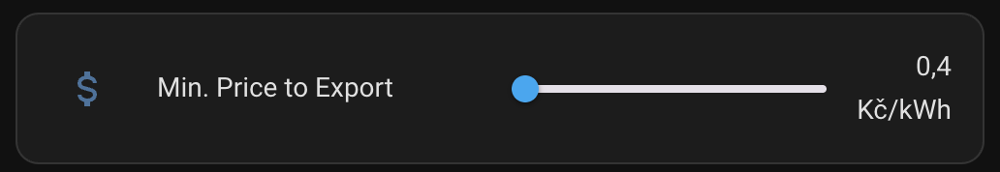

# Custom sensors

- [export_spot_price.yml](#export-spot-price)

## Export Spot Price

Sensor to configure, via the UI, the minimum value to allow exporting excedents from a photovoltaic system.

Source: [HERE](export_spot_price.yml)